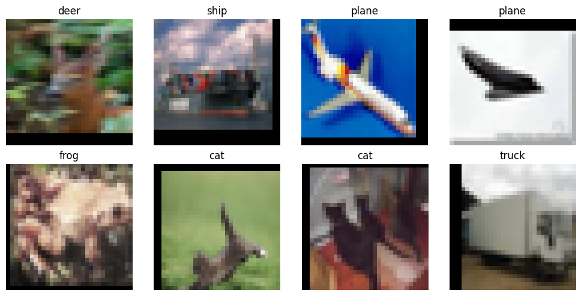
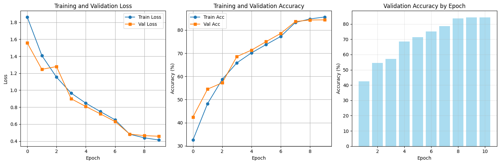
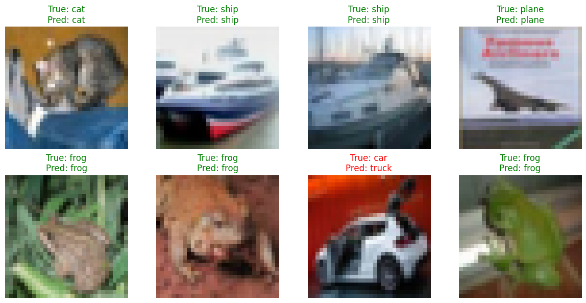

# ResNet-18 Image Classification on CIFAR-10

This project implements a ResNet-18 convolutional neural network for image classification on the CIFAR-10 dataset using PyTorch. It provides an educational example of building a deep residual network from scratch with full training, evaluation, and visualization.

---

## Project Features

- Custom ResNet-18 architecture implementation
- Data augmentation and normalization for CIFAR-10 images
- Training pipeline with SGD optimizer and learning rate scheduling
- Visualization of training & validation loss and accuracy curves
- Per-class accuracy evaluation on test dataset
- Visualization of model predictions on CIFAR-10 images
- Model saving for future reuse

---

## Getting Started

### Prerequisites

- Python 3.7 or higher  
- PyTorch 2.x  
- torchvision  
- numpy  
- matplotlib  
- tqdm  

Install dependencies using:
pip install -r requirements.txt


---

### Dataset

The project uses the CIFAR-10 dataset, which will be automatically downloaded by the torchvision datasets module.

---

### Usage

Run the training and evaluation script:
python train_resnet18_cifar10.py


This will train the model on CIFAR-10, display training progress in the console, show plots of training/validation curves, and visualize sample predictions. The trained model will be saved as `resnet18_cifar10.pth`.

---

## Results and Visualizations

### Sample CIFAR-10 Images



---

### Training and Validation Curves


---

### Sample Model Predictions



---

## Training Summary

- PyTorch version: 2.8.0+cu126  
- Device: CUDA-enabled GPU  
- Training dataset size: 50,000 samples  
- Test dataset size: 10,000 samples  
- Classes: 10 CIFAR-10 categories  
- Model parameters: 11,173,962  

### Performance Over 10 Epochs

| Epoch | Train Loss | Train Acc | Val Loss | Val Acc | Learning Rate |
|-------|------------|-----------|----------|---------|---------------|
| 1     | 1.863      | 32.53%    | 1.558    | 42.45%  | 0.1           |
| 2     | 1.408      | 48.23%    | 1.246    | 54.50%  | 0.1           |
| 3     | 1.154      | 58.69%    | 1.279    | 57.22%  | 0.1           |
| 4     | 0.966      | 65.84%    | 0.899    | 68.56%  | 0.1           |
| 5     | 0.848      | 70.16%    | 0.808    | 71.34%  | 0.1           |
| 6     | 0.748      | 73.74%    | 0.721    | 75.02%  | 0.1           |
| 7     | 0.651      | 77.24%    | 0.631    | 78.55%  | 0.01          |
| 8     | 0.481      | 83.28%    | 0.483    | 83.67%  | 0.01          |
| 9     | 0.439      | 84.81%    | 0.465    | 84.34%  | 0.01          |
| 10    | 0.413      | 85.65%    | 0.457    | 84.40%  | 0.01          |

### Per-Class Accuracy on Test Set

| Class  | Accuracy |
|--------|----------|
| plane  | 85.70%   |
| car    | 92.70%   |
| bird   | 76.10%   |
| cat    | 63.20%   |
| deer   | 82.10%   |
| dog    | 82.30%   |
| frog   | 88.30%   |
| horse  | 88.20%   |
| ship   | 93.40%   |
| truck  | 92.00%   |

Overall test accuracy: **84.40%**

---

## Model Saving and Loading

The trained model is saved as `resnet18_cifar10.pth`. You can load this saved model for inference or further fine-tuning.

---

## Folder Structure
---

```
resnet18-cifar10/
│
├── README.md
├── requirements.txt
├── train_resnet18_cifar10.py
├── ResNet_18_Image_Classification_System.ipynb     // Google colab Notebook
└── images/
├── cifar10_sample.png
├── training_validation_curves.png
└── sample_predictions.png
```
---
